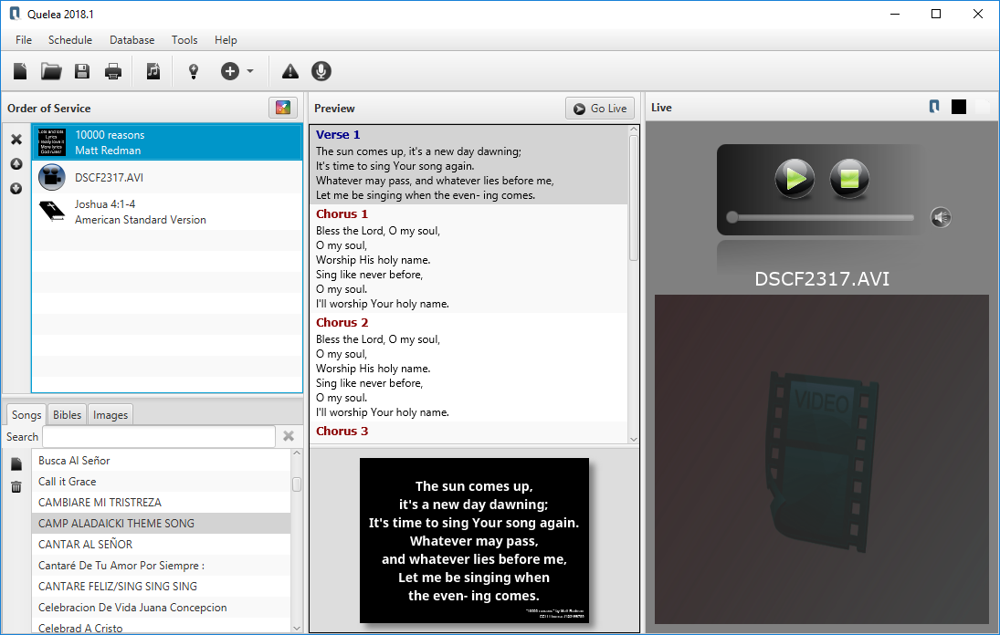

  

 
 
# Quelea

**Are you here to download the latest version? Great! You want one of these:**

[**2022.0 - Windows x64**](https://github.com/quelea-projection/Quelea/releases/download/v2022.0/quelea-2022.0-x64-windows-install.exe)

[**2022.0 - Cross platform (requires Java)**](https://github.com/quelea-projection/Quelea/releases/download/v2022.0/quelea-2022.0-crossplatform-install.jar)

[**2022.0 - Mac**](https://github.com/quelea-projection/Quelea/releases/download/v2022.0/quelea-2022.0-mac.zip)

[**2022.0 - Linux**](https://snapcraft.io/quelea) 

**Problems or suggestions? [Head over to our forum and feel free to ask away](https://quelea.discourse.group/). We don't bite!**

## CI releases
You can see the latest CI release [here](https://github.com/quelea-projection/Quelea/releases/tag/CI-RELEASE). Windows, Mac and Crossplatform installers are provided.

If you're using Linux, then no separate download is needed. Just [install snapd](https://snapcraft.io/docs/installing-snapd) and run `sudo snap install --edge quelea` to install the latest CI version.

CI releases are automatically built from the latest code in this repository, and thus are not fully tested. **They should not be used in production settings.**

## Documentation

If you're interested in learning more about how to use Quelea, the documentation can be found [here](https://quelea-projection.github.io/docs/).

## I've found a bug!
Please report it so we can fix it! Feel free to [create an issue](https://github.com/quelea-projection/Quelea/issues), and provide as much information as you can on how to reproduce the problem (step by step instructions for recreating the issue after starting Quelea are very useful.) After recreating the problem, you should also attach your [debug log](https://quelea-projection.github.io/docs/Debug_log) - this may give us a few technical clues as to what's going on.

Please note that if we can't recreate a bug, then we can't fix it, so providing as much information as you can here is very important.

## I'd like to contribute
Great! Please see our specific [contributing guidelines](CONTRIBUTING.md) for more information.
