# Setup Guide

## Dependencies

Quelea is built on [Java 1.11](https://docs.aws.amazon.com/corretto/latest/corretto-11-ug/downloads-list.html) and [Gradle](https://gradle.org/); you will need those tools installed locally to compile the application.

## Step-by-step (IDEA)

If you're not familiar with working on Java desktop applications, you can follow these steps to get started contributing to Quelea using [IntelliJ IDEA](https://www.jetbrains.com/idea/). IntelliJ IDEA is not required to work on Quelea; these are just steps for getting started if you're not already familiar with Java IDEs.

The instructions below use IntelliJ version 2022.2.2.

1. Download and install [IntelliJ IDEA](https://www.jetbrains.com/idea/download) Community version for free. Gradle is bundled with it. A Java JDK 11 might be downloaded from within IntelliJ as well - see step 11.
2. Fork the Quelea repository and git clone it locally.
3. Open IntelliJ IDEA.


4. Choose _Get from VCS_ from the top right of the welcome window.

  

5. In the _URL_ box paste the URL to your Quelea Github fork
6. In the _Directory_ box either type the path you want to store the files (`/home/user/development/Quelea` in the screenshot) or click the folder icon on the right to use the file browser
7. Click _Clone_ and IntelliJ will copy down the relevant files.  This will take a few minutes
8. Once IntelliJ has copied the files it will open and present you with the readme file.
9. In the bottom right you should see a pop-up message stating that Gradle script files have been found.  Click _Load_ to import these.

  

10. IntelliJ will ask if you want to trust this Gradle project.  If you do, click  _Trust Project_.  Note the import will not continue if you choose to stay in safe mode.

  

11. Open Project Structure settings (File -> Project Structure... -> Project) and make sure that you have a Java JDK 11 selected as SDK and that language level is set to 11.

  

If you have no java JDK 11 installed yet, you can download one (e.g. amazon corretto 11) in the same window

  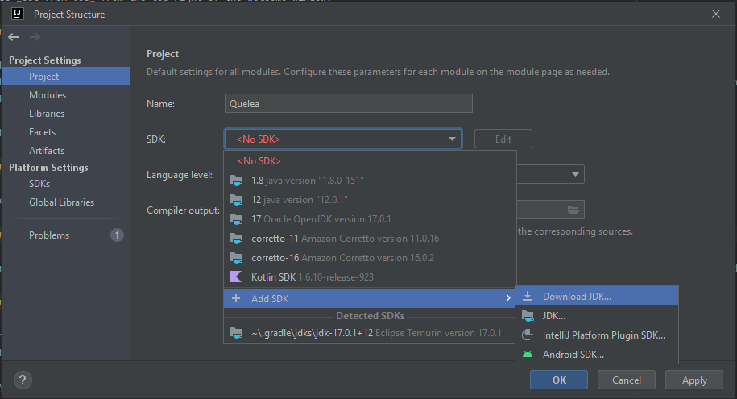

12. Open IntelliJ's _Gradle JVM_ settings (File > Settings > Build, Execution, Deployment > Gradle) and ensure that _Gradle JVM_ has the downloaded Java JDK 11 selected.  _OK_ this window.

  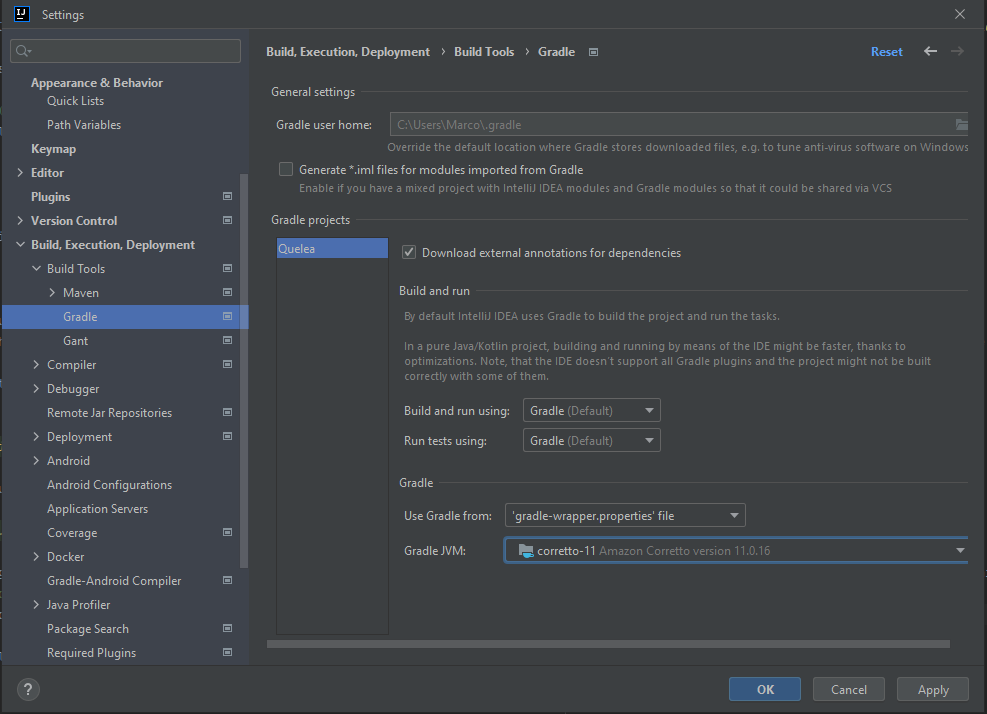

13. Search for IntelliJ's Gradle tab and unfold Quelea -> Tasks -> application. Right-click on 'run' and select Debug 'Quelea [run]'

  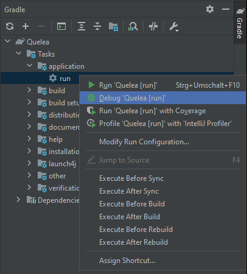

If everything went smoothly, you should see Quelea launch. You're now ready to make and test changes!

### Getting your GitHub fork URL
While looking at your GitHub fork there is a green _Code_ button.  Click this and you will be offered several options to checkout your fork (SSH is shown).


Click the copy icon to the right of the text box.  This is what you'll paste into IntelliJ.

## Step-by-Step (vscode)
Alternatively you can use [Visual Studio Code](https://code.visualstudio.com/) to develop Quelea. Further instructions worked for vscode 1.74. Adapt for your situation and skip steps you've already done. Use common sense.

1. Open [Github](https://www.github.com) and log in to your Github account. Fork the [Quelea repository](https://github.com/quelea-projection/Quelea) and note the new repository URL - `https://github.com/yourusername/Quelea.git`.
2. Download, install and start [vscode](https://code.visualstudio.com/download).
3. In 'Extensions' (Ctrl+Shift+X) search and install 'Extension Pack for Java'. This will install several packages to work with Java programming language.

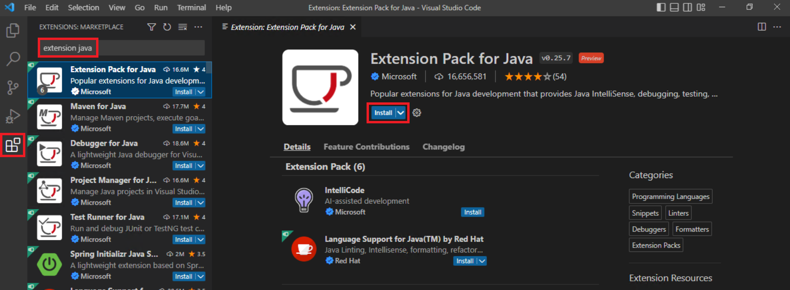

4. Soon the page 'Get started with Java Development' opens, click 'Install JDK'. Tab 'Others' has a link to Amazon Corretto. Open that link and download Amazon Corretto 11 for your platform.

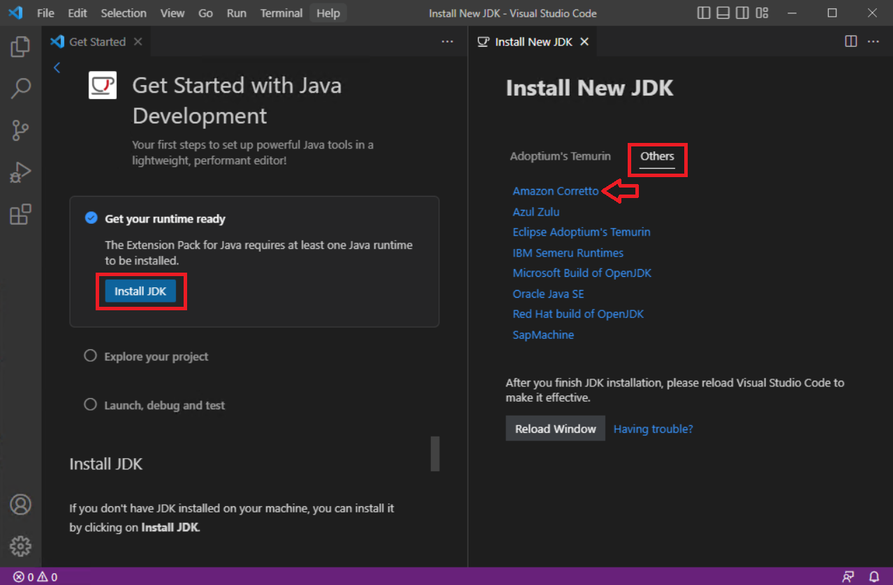

5. Install Amazon Corretto 11 to your system. Note the target folder for next step.
6. In vscode open 'Settings' (Ctrl+,) and search 'java.configuration.runtimes' then select 'Edit in settings.json'. Add your new JDK settings:
```
  {
    "name": "JavaSE-11",
    "path": "C:\\Program Files\\Amazon Corretto\\jdk11.0.17_8"
  }
```
On Windows the backslashes in 'path' must be doubled.

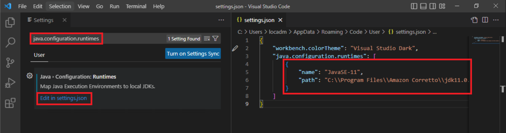

7. In 'Extensions' (Ctrl+Shift+X) search and install 'Gradle for Java'.

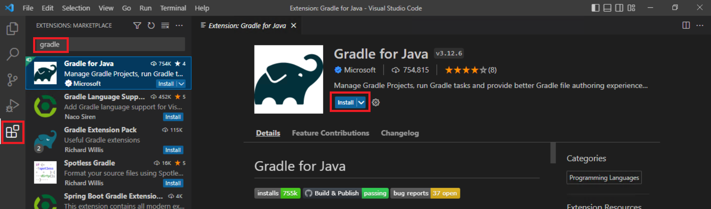

8. In 'Extensions' (Ctrl+Shift+X) search and install 'GitLens' - will help with Git management later.

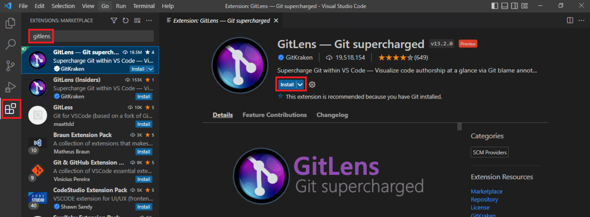

9. In 'Source Control' (Ctrl+Shift+G) select 'Clone Repository'.
10. Enter your repository URL from step 1 - `https://github.com/yourusername/Quelea.git`.

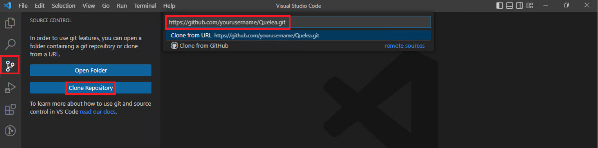

11. Select a folder for local copy of Quelea source code. Wait for the sync. It may take some time here. VSCode can ask for your Github credentials. It will use these later when you push your commits back to Github.
12. 'Open Folder' (Ctrl+K Ctrl+O) with the local source code (vscode may offer to 'View Projects' or 'Open Folder' just after git-clonning).

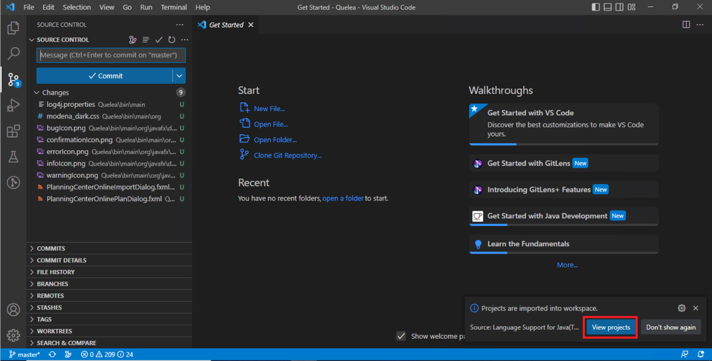

13. Select 'Yes, I trust the authors' to start gradle processing the new repo.

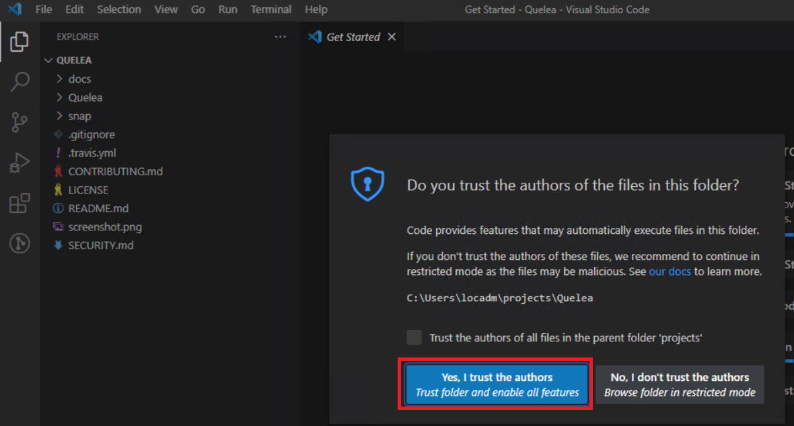

14. Wait some minutes before gradle downloads all required packages.

15. As soon as gradle finishes, 'Open Folder' (Ctrl+K Ctrl+O) and select subfolder 'Quelea' in the new repository (not the main Quelea folder).
16. Now you are ready to make changes to source files, preferably create a new git branch for every bug you fix or a new feature you develop. Git and vscode have good documentation on that.
17. Debugging is possible - 'Run and Debug' (Ctrl+Shift+D), select the Class you want to start (MainStub starts Quelea app, the others are auxiliary utilities you will probably not ever touch). Set your breakpoints, hit F5 and soon Quelea starts in debug mode.

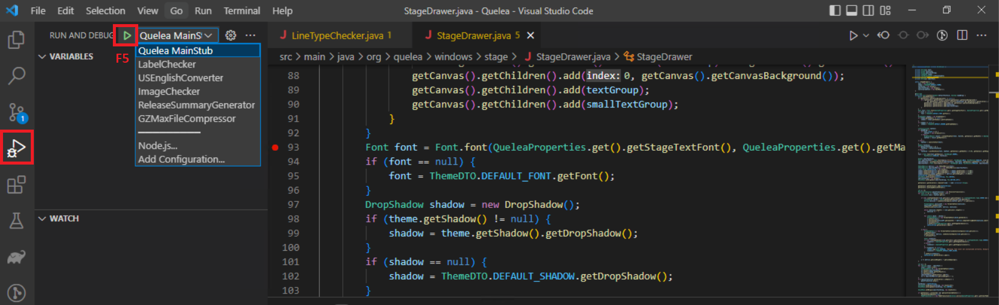

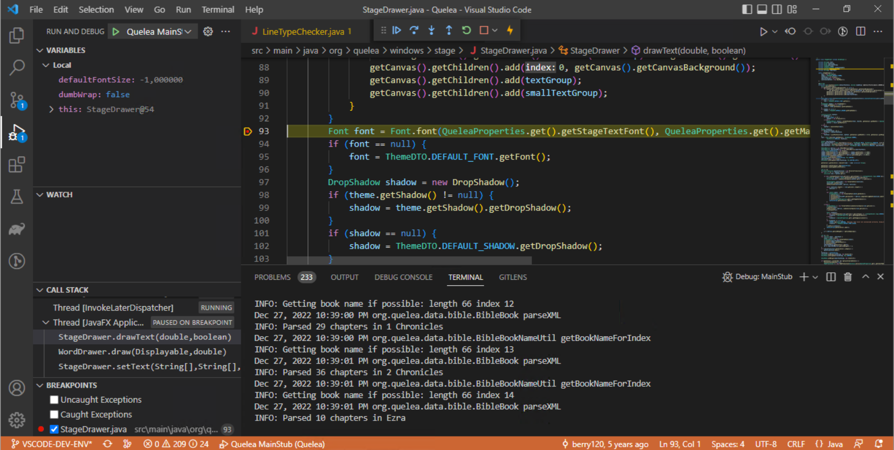
