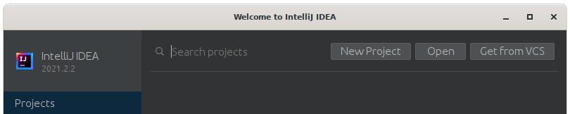

# Setup Guide

## Dependencies

Quelea is built on [Java 1.8](https://www.oracle.com/technetwork/java/javase/downloads/jdk8-downloads-2133151.html) and [Gradle](https://gradle.org/); you will need those tools installed locally to compile the application.

## Step-by-step

If you're not familiar with working on Java desktop applications, you can follow these steps to get started contributing to Quelea using [IntelliJ IDEA](https://www.jetbrains.com/idea/). IntelliJ IDEA is not required to work on Quelea; these are just steps for getting started if you're not already familiar with Java IDEs.

The instructions below use IntelliJ version 2021.2.3.

1. Download and install the [Java SE Development Kit 8](https://www.oracle.com/technetwork/java/javase/downloads/jdk8-downloads-2133151.html) for your platform.
2. Download and install [IntelliJ IDEA](https://www.jetbrains.com/idea/download) Community version for free.  Gradle is bundeld with it.
3. Fork the Quelea repository and git clone it locally.
4. Open IntelliJ IDEA.

  

5. Choose _Get from VCS_ from the top right of the welcome window.

  

6. In the _URL_ box paste the URL to your Quelea Github fork
7. In the _Directory_ box either type the path you want to store the files (`/home/user/development/Quelea` in the screenshot) or click the folder icon on the right to use the file browser
8. Click _Clone_ and IntelliJ will copy down the relevant files.  This will take a few minutes
9. Once IntelliJ has copied the files it will open and present you with the readme file.
10. In the bottom right you should see a pop-up message stating that Gradle script files have been found.  Click _Load_ to import these.

  

11. IntelliJ will ask if you want to trust this Gradle project.  If you do, click  _Trust Project_.  Note the import will not continue if you choose to stay in safe mode.

  

12. Open IntelliJ's _Gradle JVM_ settings (File > Settings > Build, Execution, Deployment > Gradle) and ensure that _Gradle JVM_ has a Java version that starts with `1.8`.  _OK_ this window.
13. Navigate to the `src/main/java/org/quelea/windows/main/Main` class.
11. Right-click on that class in the sidebar and click `Debug 'Main.main()'`

If everything's gone smoothly, you should see Quelea launch. You're now ready to make and test changes!

### Getting your GitHub fork URL
While looking at your GitHub fork there is a green _Code_ button.  Click this and you will be offered several options to checkout your fork (SSH is shown).

Click the copy icon to the right of the text box.  This is what you'll paste into IntelliJ.